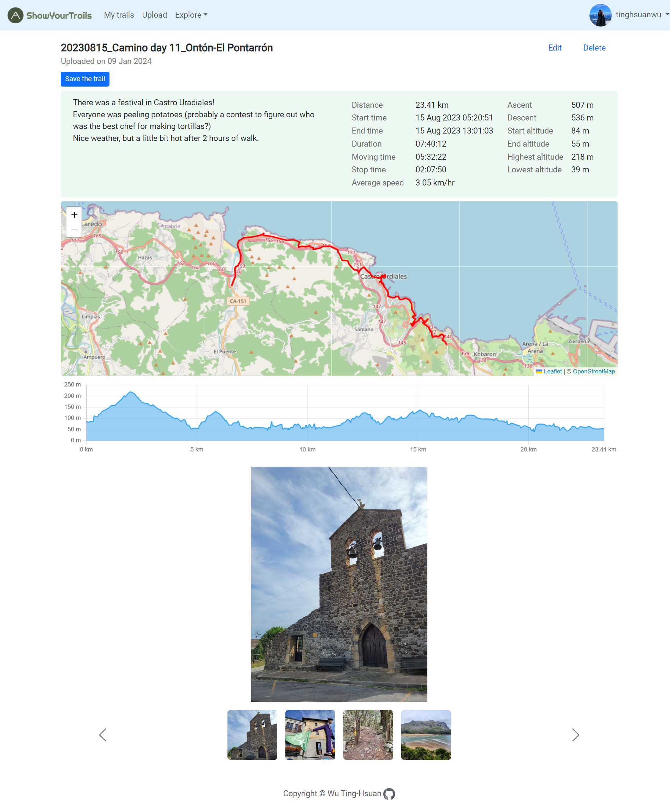
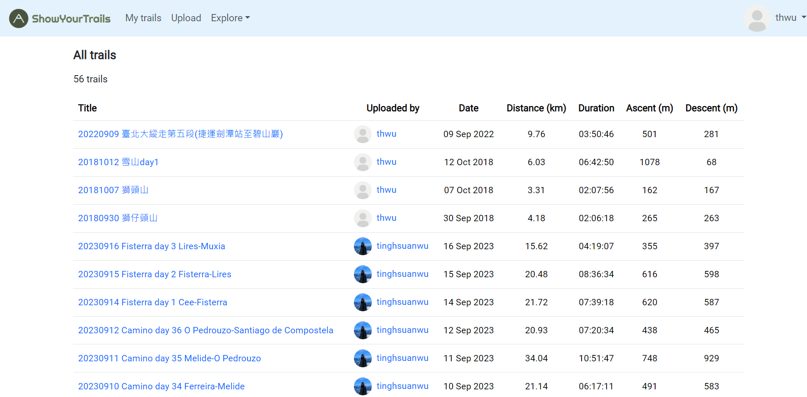
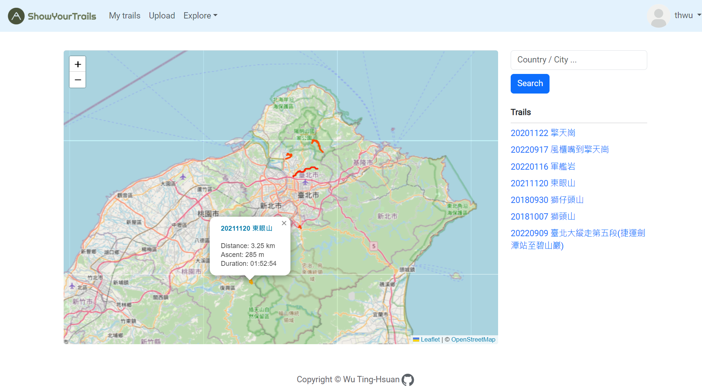
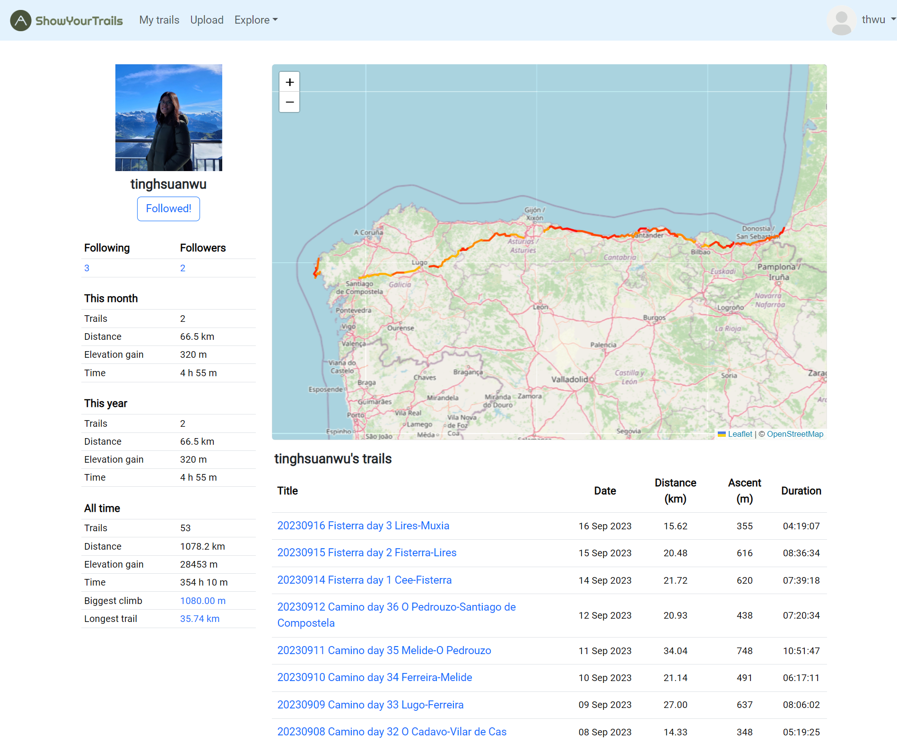
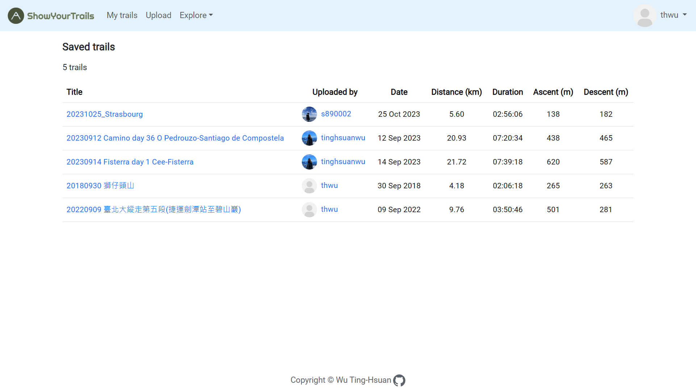
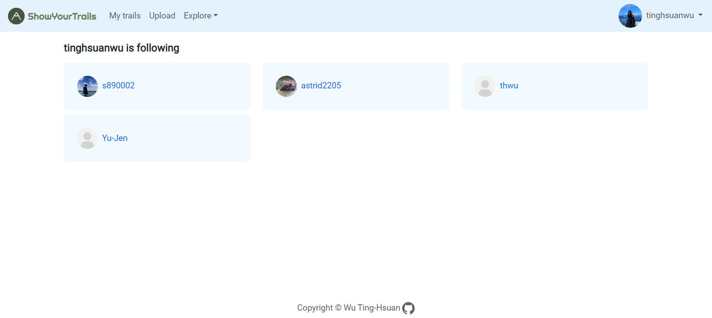

# ShowYourTrails

## Overview
[ShowYourTrails](https://showyourtrails.tech) is a Django-based web application enabling users to upload, share, and explore personalized hiking/biking trails with friends. 

Why I created the applictaion? 

I finished Camino de Santiago in Sep 2023 (Camino del Norte and Camino Primitivo).  
I wanted to showcase the footprints of my journey, but I find the presentation of journey records in existing apps unsatisfying. Therefore, I've decided to write my own.

The platform features analysis of trail and athlete statistics (distance, elevation gain, duration, speed…), 
display of trails on an interactive map, 
showcasing elevation profiles for a comprehensive user experience.

## Getting Started
Visit [ShowYourTrails](https://showyourtrails.tech) and sign up for an account to explore all the features. 

Once registered, users can begin exploring trails, saving their favorites, and connecting with other trail enthusiasts.

## Features

#### Trail Detail

- After uploading your gpx files, detailed information about each trail is available, including trail statistics, trail displaying on an interactive map, elevation profile, and user-uploaded photos. This feature offers a comprehensive view of what to expect on a particular trail.

    

- You can see the elevation, accumulating distance, and the specific point on the map when you hover over the elevation profile.

    

#### Explore Trails

- Users can explore all the trails uploaded by the community, providing a diverse range of options for outdoor adventures.

    

#### Explore Trails Within Map Area

- A map-centric feature allows users to explore trails within a specified map area, making it convenient to discover nearby routes.

    

#### User Profiles

- User profiles provide a snapshot of user statistics, showcasing their trail activity and the trails they have uploaded to the platform.

    (And this is my Camino footage!)

    

#### View Trails Saved by User

- Users can view a list of all the trails they have saved, making it easy to keep track of their favorite routes.

    

#### List of Followers
- A social aspect of the platform allows users to see a list of followers or atheletes they followed, fostering a sense of community among trail enthusiasts.

    

## Technology Stack and Deployment Information

### Technology Stack

- **Programming Languages:** Python, HTML/CSS, JavaScript
- **Framework:** Django
- **Cloud Services:** Amazon Web Services (AWS)
- **Database:** PostgreSQL (AWS RDS)
- **Web Server Deployment:** Nginx
- **Application Server Deployment:** Gunicorn
- **Static / Media File Storage:** AWS S3

### Libraries Used

- **Django Rest Framework:** Used for constructing RESTful APIs in the Django application.
- **gpxpy:** Parse GPX files uploaded by users.
- **leaflet:** Display trails on the map interactively.
- **chart.js:** Display interactive elevation profiles.
- **Pillow:** Process the photos user uploaded.
- **Bootstrap:** Front-end framework.

## Feedback and Support
If you encounter any issues or have suggestions for improvement, please [email](mailto:tinghsuan.th@gmail.com) me.

Happy Trails! 🏞️🚴‍♂️🥾